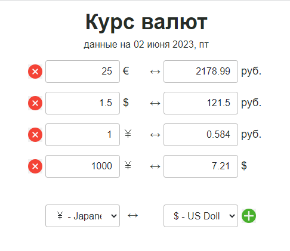

# Курсы валют и калькулятор

Проект Курсы валюты. Данные приходят с [currencyapi.com](https://currencyapi.com/).
Реализовано на ReactJS + Redux

## Основные моменты UI

В данном сервисе реализовано:
1. SPA
2. Дефолтные пары. Рубли - Доллары, Рубли - Евро
3. Возможность добавлять/удалять дополнительные пары валют (около 170 валют)
4. Встроенный калькулятор с двухсторонним расчетом сумм валют
5. Информация по отображаемым парам сохраняется в localStorage
6. Адаптивная верстка
7. Символы валют и принадлежность к стране

## Основные моменты BLL

При первом запуске и инициализации приложения идет загрузка актуальных курсов валют и информация по ним (символы, принадлежность к стране). Сразу же отображается дефолтные пары: доллар-рубль и евро-рубль. При изменении состояния происходит запись и в localStorage. При ошибке получении данных через API currencyapi.com грузятся данные за 2 июня 2023, т.к. сервис бесплатно предоставляет всего 300 запросов в месяц:(
Отображаемые пары валют можно стазу же рассчитывать в двух направлениях (как это реализовано у Яндекса).

## Применяемый стек технологий

1. ReactJS
2. redux - управление стейтом приложения
3. react-redux - связка 
4. redux-thunk - для выполнения асинхронных запросов в redux
5. react-router-dom - для роутинга в приложении
6. axios - для запросов данных
7. localStorage - локальное сохранение 

